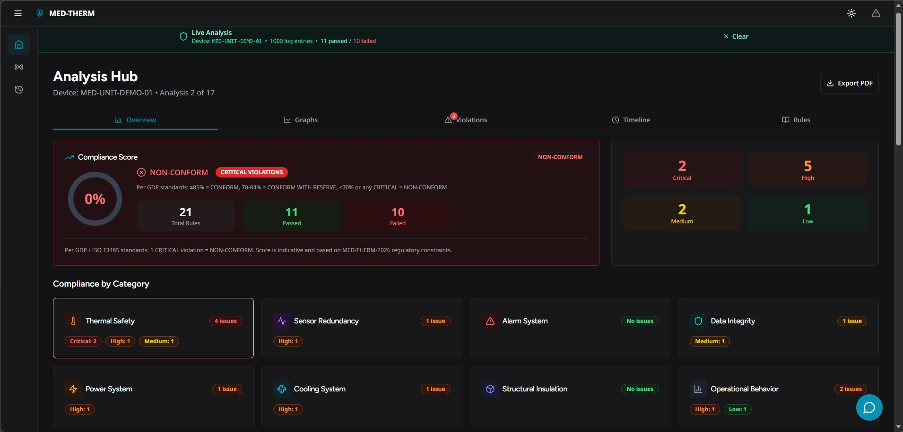
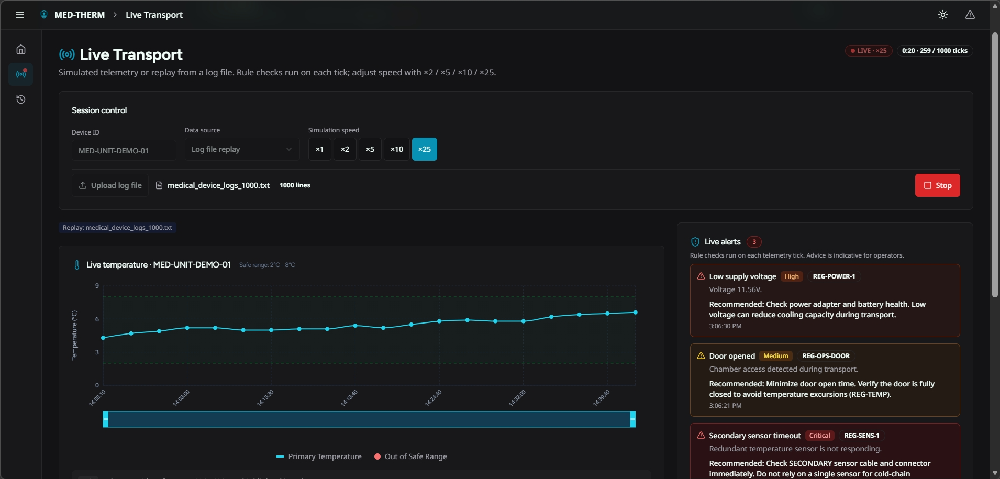
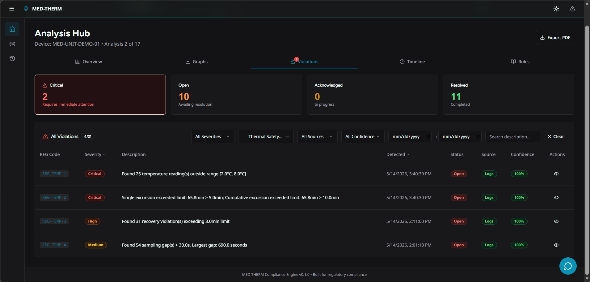

# MED-THERM Compliance Engine

Regulatory compliance validation system for temperature-controlled medical transport devices.

---

## Technologies

- **Backend**: FastAPI, SQLAlchemy, PostgreSQL
- **Frontend**: React 18, TypeScript, Vite, Tailwind CSS
- **AI**: ModelArk API
- **DevOps**: Docker, Docker Compose

---

## Quick Start

```bash
git clone https://gitlab.rinftech.lan/dev/genai/medical-ai-compliance/maic-2
cd medical-device-regulatory

# With Docker
docker-compose up --build
```

---

## 📸 Screenshots

### Dashboard Overview


### Live Transport Monitoring


### Violations & Filters


## Access

- **Frontend**: http://localhost:5173
- **API**: http://localhost:8000
- **API Docs**: http://localhost:8000/docs

---

## Complete Documentation

- [Full Guide](docs/index.md)
- [Installation](docs/getting-started/installation.md)
- [Architecture](docs/architecture/overview.md)
- [User Guide](docs/user-guide/)
- [For Developers](docs/developer-guide/)
- [Roadmap](docs/roadmap/)

